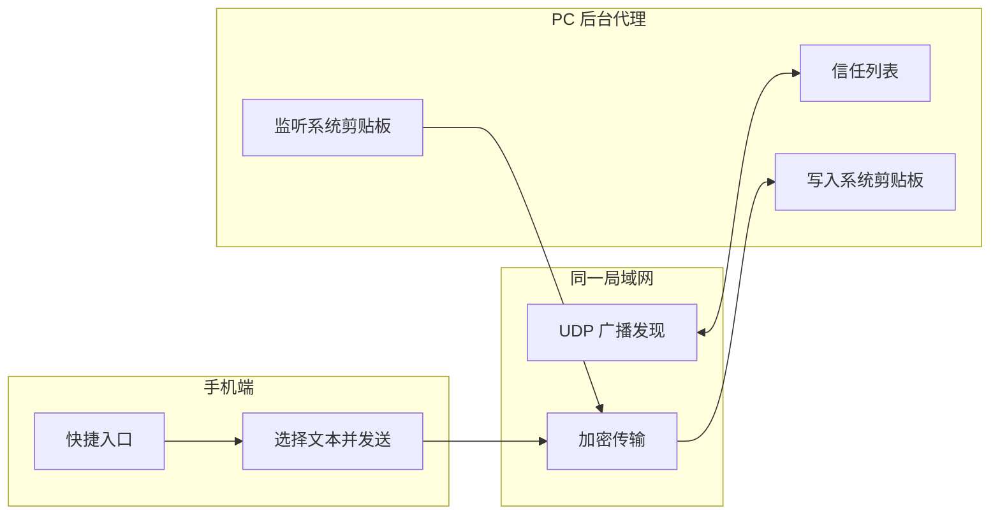

# span

跨设备数据互通，第一版先做文本剪贴板同步。优先级是：**占用最小、速度最快、体验最直观**。

## 目标

- PC 端默认后台常驻
- 手机端通过快捷入口发送文本
- 局域网自动发现设备
- 仅对已信任设备广播
- 后台自动刷新可信设备 IP
- 第一版只做纯文本
- 优先保持极小包体和极低后台占用

## 架构



## 交互原则

- PC 端后台由无窗口 daemon 常驻；关闭 GUI 不会停止同步
- 普通用户只需要原生 GUI 的 “添加设备”和“移除设备” 两个操作
- 首次发现设备时弹窗确认配对；接受后直接使用系统复制/粘贴
- 每次复制自动发送给全部已信任设备；不会把剪贴板正文广播给陌生设备
- CLI 仅用于调试、脚本和故障排查
- 手机端保留一个明确的发送动作

## 代码结构

- `crates/span-core`：核心模型与协议类型
- `crates/span`：桌面后台守护进程入口
- `docs/discovery-protocol.md`：设备发现和文本传输协议
- `docs/pc-mvp.md`：PC 端 MVP 使用说明
- `docs/release.md`：GitHub Actions 发布说明
- `apps/android`：Android V1 App（双向文本、剪贴板一键发送 / 分享菜单 / Quick Settings Tile / 接收服务）
- `apps/android/README.md`：Android 构建、配对和限制
- `apps/android/docs/background-setup`：Android 无障碍、后台保活及各厂商设置说明
- `docs/mobile-ios-plan.md`：暂缓的 iOS 方案草稿（当前不参与 V1）

## npm 安装（桌面端）

桌面端提供 npm 安装器。npm 包本身只包含极小的 Node 启动脚本，安装时根据当前系统下载对应的 Rust 二进制，不引入 Electron 或其他重型运行时。

```sh
npm install -g span-desktop
span install
```

`span install` 会把 daemon 注册为 macOS LaunchAgent、Windows 登录任务或 Linux 自启动项，因此不需要让终端窗口一直开着。

本地测试 npm 包：

```sh
cargo build --release -p span --bins
cd npm/span-desktop
npm pack
SPAN_LOCAL_BINARY="$PWD/../../target/release/span" \
SPAN_LOCAL_GUI_BINARY="$PWD/../../target/release/span-gui" \
  npm install --prefix /tmp/span-npm-prefix ./span-desktop-*.tgz
/tmp/span-npm-prefix/node_modules/.bin/span --help
```

正式 npm 安装会下载 GitHub Release 中对应平台的包；本地测试需要同时提供 CLI 和 GUI：`SPAN_LOCAL_BINARY`、`SPAN_LOCAL_GUI_BINARY`。


## Release 产物

GitHub Actions 的桌面压缩包现在只放最小可运行内容，不再塞 README/协议文档：

- macOS：压缩包里只有 `Span.app`，用户双击即可打开 GUI
- Windows：优先下载 `span-windows-x64-setup.exe` 标准安装器；另保留含 `span-gui.exe` 和 `span.exe` 的免安装 zip
- Linux：只有 `span` 和 `span-gui`
- Android：普通用户下载固定发布密钥签名的 `span-android-release.apk`；`span-android-debug.apk` 仅用于调试

> 从 `v0.1.2-test.34` 或更早的 Android 测试包迁移时，需要先卸载旧 APK，再安装首个固定签名版本并重新配对。旧测试包使用了临时 debug 证书，Android 不允许直接覆盖为新的正式证书；完成这一次迁移后，后续正式版本即可直接覆盖升级。

保留两个桌面二进制是为了同时满足：GUI 双击不弹终端、CLI/daemon 仍可被脚本和自启动调用。

## 发布

PC 端通过 GitHub Actions 自动打包，不要求用户本地构建。见 `docs/release.md`。

iOS 当前暂缓，不纳入 V1 构建和发布；先把 Android → PC 的低占用文本链路验证稳定。

## 桌面端使用

普通用户直接运行：

```sh
span
```

它会打开轻量设备管理界面，不需要记 CLI 命令。对外只保留以下简短命令：

```sh
span install              # 安装并启用登录自启
span start                # 启动后台同步
span stop                 # 停止后台同步
span restart              # 重启后台同步
span discover             # 查找同一局域网设备
span accept [编号]        # 接受配对；只有一台时可省略编号
span send [文本]          # 发送文本；省略文本时发送当前剪贴板
```

设备发现本身由后台 daemon 自动完成；`discover` 只是需要立即刷新时使用。其他旧子命令仅为兼容调试脚本保留，不显示在普通帮助中。

## Android 端

Android V1 支持 Android → PC 主动发送，也支持 PC → Android 接收并写入系统剪贴板；手机端不做后台剪贴板读取监听。详见 [`apps/android/README.md`](apps/android/README.md)。

首次安装后请按 [`Android 无障碍与后台设置总览`](apps/android/docs/background-setup/README.md) 完成通知、无障碍和电池优化设置。各厂商的详细入口：

- [小米 / Redmi（HyperOS、MIUI）](apps/android/docs/background-setup/xiaomi-redmi.md)
- [OPPO / 一加 / realme（ColorOS）](apps/android/docs/background-setup/oppo-oneplus-realme.md)
- [华为（HarmonyOS、EMUI）](apps/android/docs/background-setup/huawei.md)
- [荣耀（MagicOS）](apps/android/docs/background-setup/honor.md)
- [vivo / iQOO（OriginOS、Funtouch OS）](apps/android/docs/background-setup/vivo-iqoo.md)
- [三星（One UI）](apps/android/docs/background-setup/samsung.md)

```sh
cd apps/android
JAVA_HOME=$(/usr/libexec/java_home -v 21) ./gradlew :app:testDebugUnitTest :app:assembleDebug
```


## 快速验证

两台电脑连接同一局域网后，两边分别执行一次：

```sh
span install
span discover
span accept
```

如果发现多台待配对设备，`span accept` 会显示编号，再执行：

```sh
span accept 1
```

配对完成后不需要 Span 专用复制命令，直接使用系统的 `Command/Ctrl+C` 与 `Command/Ctrl+V`。如需手动立即发送当前剪贴板：

```sh
span send
```

运行 `span` 或 `span gui` 可打开轻量原生设备管理 GUI。GUI 只显示本机和受信任设备，提供发现、配对确认和删除设备；不提供手动发送、启动同步等重复操作。GUI 不使用 Electron、Flutter 或 WebView。
